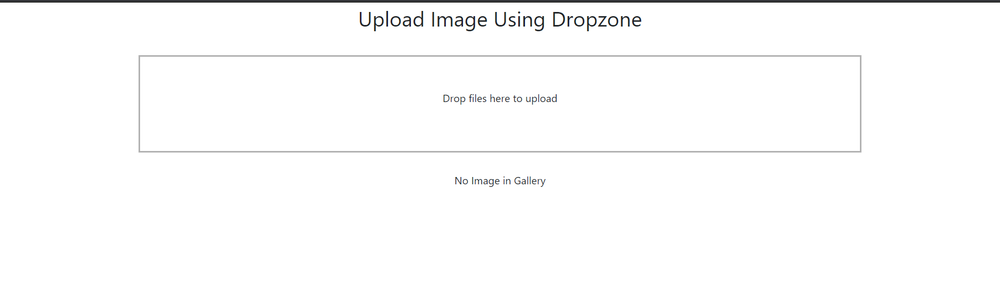
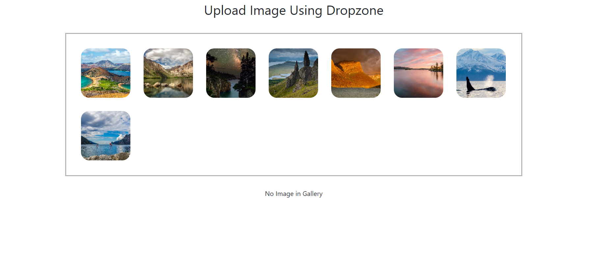
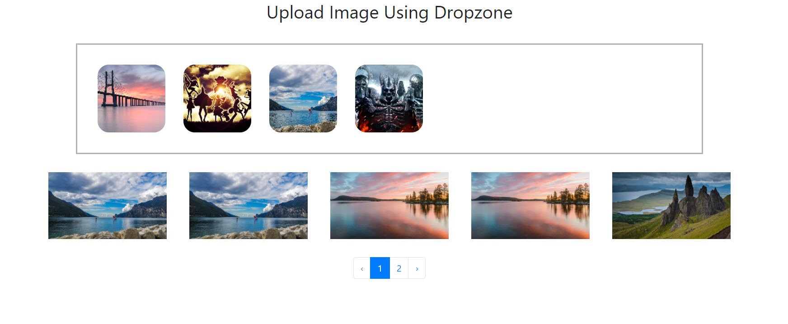

# Laravel 7 Dropzone - Upload Multiple File

Laravel 7 upload multiple file image using dropzone js. In this tutorial, you will learn how to upload multiple image file in laravel using dropzone js.

When you use dropzone js for multiple image upload in laravel. At that time, the dropzone js box shows a preview of each image.

This laravel dropzone js tutorial will guide you on how to upload single or multiple image file in laravel app. And display preview of image file using on drop box.

Note that, you will not have to write a separate code to show the preview of the image in laravel app with dropzone js. Dropzone js will automatically show a preview of the image file.

--------------------------------------------------------------------
### Laravel Upload Multiple Files Using Dropzone js
Follow the simple and easy steps to upload multiple file image using dropzone js in laravel:
- Install Laravel App
- Setup Database Credentials in .env
- Create Route
- Generate a Controller & Model
- Create a View File
- Start Development Server

_____________________________________________________________________
#### Step 1: Install Laravel App
First of all, you need to install the laravel fresh application. So run the following command to create laravel dropzone image upload project:

``` 
composer create-project --prefer-dist laravel/laravel laravelDropzone
```
___________________________________________________________________
#### Step 2: Setup Database Credentials in .env
In this step, go to your project directory and open .env file and set your database credentials like this:

```
 DB_CONNECTION=mysql 
 DB_HOST=127.0.0.1
 DB_PORT=3306
 DB_DATABASE=databasename
 DB_USERNAME=db_username
 DB_PASSWORD=db_password
```

___________________________________________________________________
#### Step 3: Create Route
In this step, you need to create two routes for upload image using dropzone in laravel.
So navigate to routes folder and open `web.php`. Then update the following routes into `web.php` file:

```php
Route::get('dropzone/image','ImageController@index');
Route::post('dropzone/store','ImageController@store');
```

___________________________________________________________________

#### Step 4: Generate a Controller & Model
In this step, you need create one controller and one model using the below-given command. So open your terminal and run following command:

```
cd/project_name
```

Then run the below command on command prompt:
```
php artisan make:model Image -mcr
```

The above command will create one model name `Image` model, migration file for `Image Table` and also will create one controller name `ImageController.php`.

Now, navigate to database/migrations directory and open create_images_table.php file and add the following code in create_images_table.php file:

```php
<?php
 
use Illuminate\Database\Migrations\Migration;
use Illuminate\Database\Schema\Blueprint;
use Illuminate\Support\Facades\Schema;
 
class CreateImagesTable extends Migration
{
    /**
     * Run the migrations.
     *
     * @return void
     */
    public function up()
    {
        Schema::create('images', function (Blueprint $table) {
            $table->id();
            $table->string('title');
            $table->timestamps();
        });
    }
 
    /**
     * Reverse the migrations.
     *
     * @return void
     */
    public function down()
    {
        Schema::dropIfExists('images');
    }
}

```

Now, open your terminal and run the php artisan migrate command to create image table into your database:
```
php artisan migrate
```

Next, Navigate to `app/http/controllers` direcotry and open `Controller.php`. add into file:
```php
<?php

namespace App\Http\Controllers;

use Illuminate\Foundation\Auth\Access\AuthorizesRequests;
use Illuminate\Foundation\Bus\DispatchesJobs;
use Illuminate\Foundation\Validation\ValidatesRequests;
use Illuminate\Routing\Controller as BaseController;

class Controller extends BaseController
{
    use AuthorizesRequests, DispatchesJobs, ValidatesRequests;

    public function uploadImage($image , $dir = 'image'){
        $uploadImage = $image;
        $imagename = time(). '.' . $uploadImage->getClientOriginalExtension();
        $direction = public_path('/'.$dir.'/');
        $uploadImage->move($direction,$imagename);
        $imagePath = $dir. '/' . $imagename ;
        return $imagePath;
    }

}
```


Next, Navigate to `app/http/controllers` direcotry and open `ImageController.php`. Then update the following methods into your `ImageController.php` file:

```php
<?php

namespace App\Http\Controllers;

use App\Image;
use Illuminate\Http\Request;

class ImageController extends Controller
{
    /**
     * Display a listing of the resource.
     *
     * @return \Illuminate\Http\Response
     */
    public function index()
    {
        $images = Image::select('id','title');
        $images = $images->latest()->paginate(PAGINATION_COUNT);
        return view('image',compact('images'));
    }
    public function store(Request $request)
    {
        // save data in DB
        // to img store
        if($request->hasFile('file')){
            // update img
            $imagePath = parent::uploadImage($request->file('file'),'image');
            $request['title'] = $imagePath ;
        }
        Image::create($request->all());
    }
}
```

___________________________________________________________
#### Step 5: Create Blade view 
In this step, you need to create a blade view file. So navigate to `/resources/views` folder and create one file name `image.blade.php`.

After that, add the following code into your `image.blade.php` file:
```html
<!DOCTYPE html>
<html>
<head>
    <meta charset="utf-8">
    <title>Laravel Upload Image Using Dropzone</title>
    <link rel="stylesheet" href="{{asset('css/app.css')}}">

    <link rel="stylesheet" href="https://maxcdn.bootstrapcdn.com/bootstrap/4.0.0/css/bootstrap.min.css">
    <script src="https://code.jquery.com/jquery-3.2.1.slim.min.js"></script>
    <script src="https://cdnjs.cloudflare.com/ajax/libs/popper.js/1.12.9/umd/popper.min.js"></script>
    <script src="https://maxcdn.bootstrapcdn.com/bootstrap/4.0.0/js/bootstrap.min.js"></script>
    <link rel="stylesheet" href="https://cdnjs.cloudflare.com/ajax/libs/dropzone/5.5.0/min/dropzone.min.css">

    <script defer src="https://cdnjs.cloudflare.com/ajax/libs/dropzone/5.5.0/dropzone.js"></script>
</head>
<body>
<div class="container">
    <h2 style="display:flex;justify-content: center;align-items: center; padding: 5px 0px">Upload Image Using Dropzone</h2><br/>
    <form method="post" action="{{route('dropzone.store')}}" enctype="multipart/form-data"
          class="dropzone" name="img" id="dropzone">
        @csrf
    </form>

    <div style=" width: 90%;margin:30px auto;display:flex;justify-content: center;align-items: center;">
        @forelse($images as $image)
            title)}}" width="25%" height="25%" alt="{{$image->id}}">
        @empty
            No Image in Gallery
        @endforelse
    </div>
        <div style="display:flex;justify-content: center;align-items: center; ">
            {{ $images->links() }}
        </div>
</div>
<script type="text/javascript">
    Dropzone.options.dropzone =
        {
            maxFilesize: 10,
            renameFile: function (file) {
                var dt = new Date();
                var time = dt.getTime();
                return time + file.name;
            },
            acceptedFiles: ".jpeg,.jpg,.png,.gif",
            addRemoveLinks: true,
            timeout: 60000,
            success: function (file, response) {
                console.log(response);
            },
            error: function (file, response) {
                return false;
            }
        };
</script>
</body>
</html>
```

In the above view blade file, we necessary to include dropzone js and CSS. Here we are going to use CDN js and CSS of dropzone in laravel.

-----------------------------------------------------------------
#### Step 6: Start Development Server
Finally, you need to start the development server. So run the following PHP artisan serve command to start your web server:

```
php artisan serve
```

Now you are ready for this laravel dropzone image upload example. So open your browser and hit the following urls on it:

```
http://127.0.0.1:8000/dropzone/image
```

-----------------------------------------------------------
### Finally, the laravel dropzone multiple image file upload project looks like:







-----------------------------
# Thank you for read 
###A7med Qeshta.


